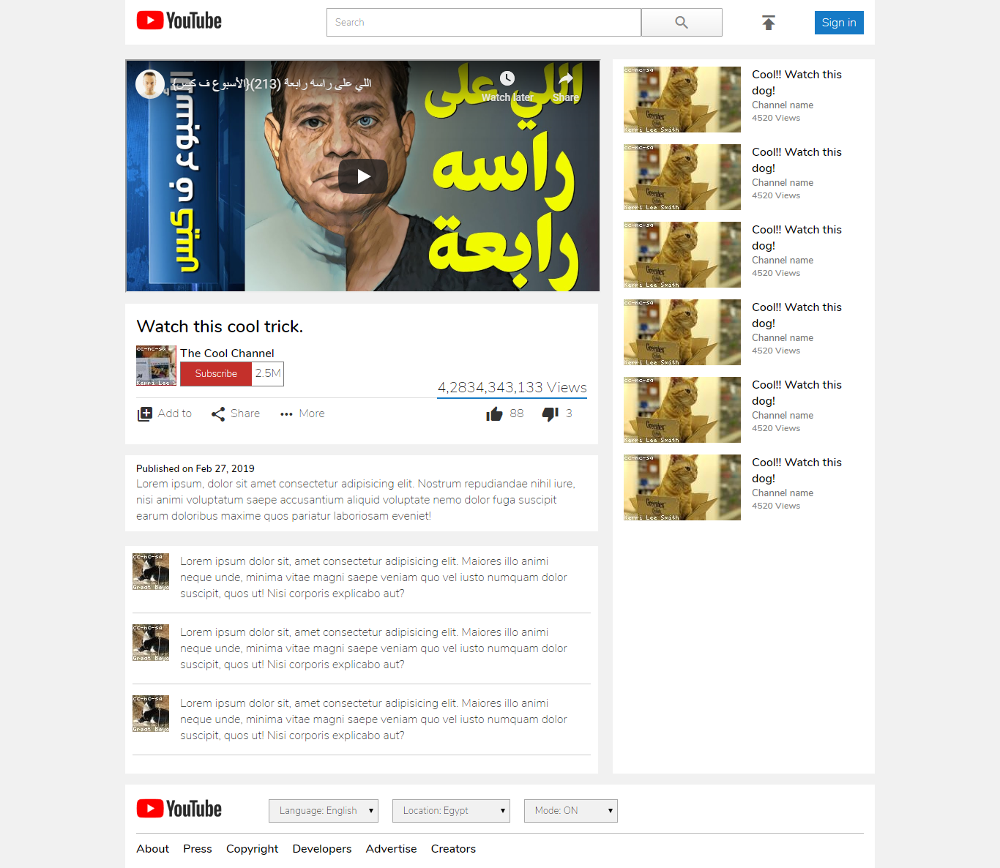

# Youtube Clone

> An HTML/CSS clone of Youtube for Microverse.

## Screenshot

## Live Version

Click [here](https://rawcdn.githack.com/aldemeery/youtube-clone/dfa44ae963999c8c3b543817846dc7f52524a8a2/index.html) to view a live version.

## Authors

👤 **Shingirayi Innocent**

-   Github: [@simandebvu](https://github.com/simandebvu)
-   Twitter: [@simandebvu](https://twitter.com/simandebvu)
-   Linkedin: [simandebvu](https://linkedin.com/in/simandebvu)

👤 **Osama Aldemeery**

-   Github: [@aldemeery](https://github.com/aldemeery)
-   Twitter: [@aldemeery](https://twitter.com/aldemeery)
-   Linkedin: [osamaaldemeery](https://linkedin.com/in/osamaaldemeery)

## 🤝 Contributing

Contributions, issues and feature requests are welcome!

Feel free to check the [issues page](issues/).

## Show your support

Give a ⭐️ if you like this project!

## 📝 License

This project is [MIT](LICENSE) licensed.
